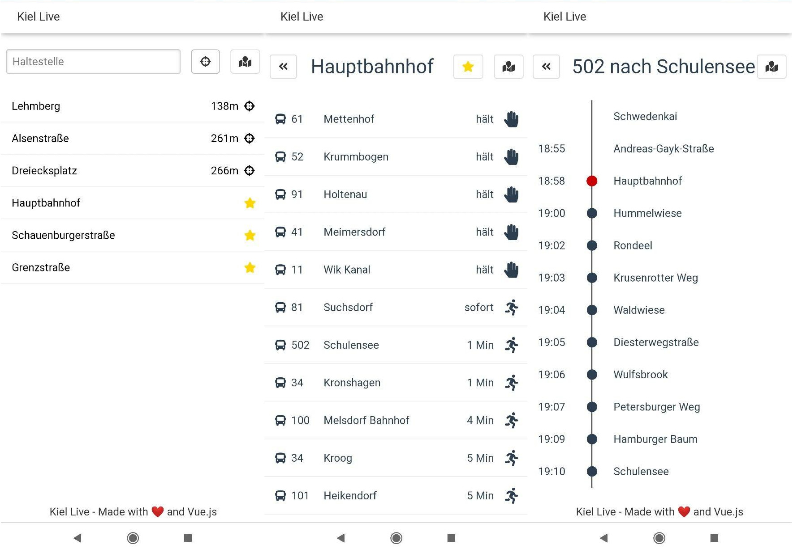

# kiel-live

[](https://github.com/anbraten/kiel-live/actions?query=workflow%3A%22Docker+Build%22)
[](https://github.com/anbraten/kiel-live/actions?query=workflow%3ALinting)
[](https://microbadger.com/images/anbraten/opnv-live)

This wep app allows you to view live updates of bus arrivals.

[](https://hub.docker.com/r/anbraten/opnv-live)

## Features

* Show realtime information (route, direction, eta) of bus arrvials on a specific stop
* Add stops to favorites for everyday use
* View trip stops of currently driving busses
* Show nearby stops and distance by using gps location
* View stops and realtime bus locations on a map

## Screenshots



## Install on server

```bash
docker pull anbraten/opnv-live
```

## Development

### Project setup

```bash
yarn
```

### Compiles and hot-reloads for development

```bash
yarn dev
```

### Compiles and minifies for production

```bash
yarn build
```

### Lints and fixes files

```bash
yarn lint

yarn lint:fix
```

## Roadmap

See [Roadmap](https://github.com/anbraten/opnv-live/projects/1)

## API

The backend is accessable via socket.io-websocket (`/api/socket/`).

Most endpoints are working like REST calls.
For real-time events there are three special endpoints you have to use.
You first have to call `xxx/:id/subscribe` to subscribe to something. Then you will receive updates to `xxx/:id` until you unsubsribe again by calling `xxx/:id/unsubscribe`.
All results are returned to the same address you requested data from.

### Datatypes

#### ID clashing

To prevent id clashing by data from multiple provides always use `<provider><id>` as the actual id.

#### Stop

A `stop` is a fixed point their for example a bus stop or a car-sharing parking spot is located.

```json

{
  "id": "<provider:string><id:string>",
  "name": "<name:string>",
  "provider": "<provider:string>",
  "type": "<type:string>", // BUS_STOP, PARKING_SPOT, FERRY_STOP, TRAIN_STOP, SUBWAY_STOP
  "routes": [
    "<route-id:string>"
  ],
  "alerts": [
    "<alert:string>", // general alerts for this stop
  ],
  "arrivals": [
    {
      "name": "<name:string>",
      "vehicle": "<vehicle-id:string>",
      "trip": "<trip-id:string>",
      "route": "<route-id:string>",
      "direction": "<direction:string>",
      "state": "<state:string>", // PREDICTED, STOPPING, DEPARTED
      "planned": "<planned:date>",
      "eta?": "<eta:number(seconds)>"
    }
  ],
  "location": {
    "longitude": "<longitude:number(54,306)>",
    "latitude": "<latitude:number(10,149)>",
  },
  "extra": "<*:*>"
}

```

#### Vehicle

A `vehicle` can be of a specific type (exp. bus, bike).

```json

{
  "id": "<provider:string><id:string>",
  "name": "<name:string>",
  "type": "<type:string>", // BUS, BIKE, CAR, ESCOOTER, FERRY, TRAIN, SUBWAY
  "active": "<active:boolean>",
  "state?": "<state:string>",
  "battery?": "<battery:number(percent)>",
  "location": {
    "heading": "<heading:number(degree)>",
    "longitude": "<longitude:number(54,306)>",
    "latitude": "<latitude:number(10,149)>",
  },
  "trip?": "<trip-id:string>",
  "extra": "<*:*>"
}

```

#### Trip

A `trip` is a tour represented by a list of `stops` executed by a `vehicle` (exp. bus) on a specific `route`.

```json

{
  "id": "<provider:string><id:string>",
  "vehicle": "<vehicle-id:string>",
  "direction": "<direction:string>",
  "stops": [
    {
      "id": "<stop-id:string>",
      "name": "<name:string>",
      "state": "<state:string>", // PREDICTED, STOPPING, DEPARTED
      "planned": "<planned:date>",
      "eta?": "<eta:number(seconds)>" // needed?
    }
  ],
  "extra": "<*:*>"
}

```

#### Route

A `route` is a fixed list of waypoints a vehicle could drive along. A one-time tour on a specific `route` is called a `trip`.

```json

{
  "id": "<provider:string><id:string>",
  "name": "<name:string>",
  "type": "<type:string>", // BUS, FERRY, TRAIN, SUBWAY
  "active": "<active:boolean>",
  "stops": [
    {
      "id": "<stop-id:string>",
      "location": {
        "longitude": "<longitude:number(54,306)>",
        "latitude": "<latitude:number(10,149)>",
      }
    }
  ],
  "extra": "<*:*>"
}

```

### Endpoints

#### Stops

* `/stop`: Get all stops
* `/stop/:searchByName`: Search for stops by their name
* `/stop/nearby`: Search for stops close to your location (Your position: `{ longitude, latitude }` needs to be send to this endpoint)
* `/stop/:id` Get a specific stop
* `/stop/:id/subscribe` Subscribe to a specific stop (use this to get for example: arrivlas and depatures of busses)

#### Vehicles

* `/vehicle`: Get all vehicles
* `/vehicle/:id` Get a specific vehicle (You will receive subscription updates to this endpoint as well)
* `/vehicle/:id/subscribe` Subscribe to a specific vehicle (use this to get for example: the current gps location of the vehicle)
* `/vehicle/:id/unsubscribe` Unsubscribe from a specific vehicle

#### Trips

* `/trip/:id` Get a specific trip (You will receive subscription updates to this endpoint as well)
* `/trip/:id/subscribe` Subscribe to a specific trip (use this to get for example: the current stop of the vehicle doing this trip)
* `/trip/:id/unsubscribe` Unsubscribe from a specific trip

#### Routes

TODO
