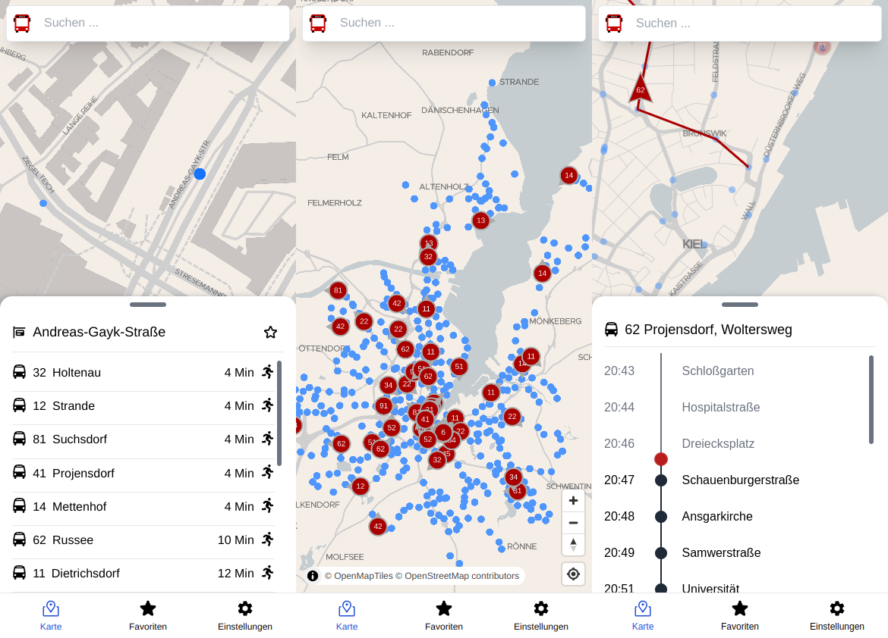
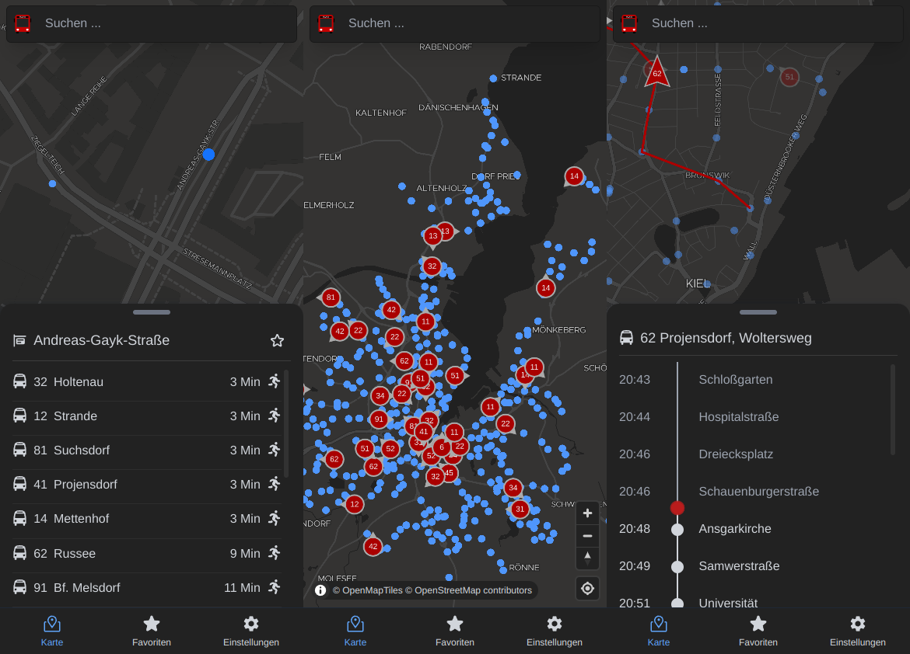

# kiel-live

This app allows you to view Kiels public transport (busses, bus-stops) in realtime.

[](https://github.com/kiel-live/kiel-live/actions?query=branch%3Amain)
[](https://github.com/kiel-live/kiel-live/releases)
[](https://gitpod.io/#https://github.com/kiel-live/kiel-live)

## Features

- View realtime bus positions and bus-stops on map
- Get realtime information (route, direction, eta) of bus arrivals of a specific bus-stop
- Add bus-stops to favorites
- View trip stops of a bus

## Screenshots




## Development

### Structure

The project contains following parts:

- `app/`: A PWA written with Vue3
- `android-app/`: A native android app wrapper of the PWA
- `collectors/*`: Multiple agents to scrape data from different apis
- `hub/`: The central hub to combine data pushed by collectors for clients
- `nats/`: The legacy NATS server used as message broker to stream data from collectors to the PWA clients

### Gitpod

[](https://gitpod.io/#https://github.com/kiel-live/kiel-live)

### PWA development

Copy the `.env.sample` file to `.env`. For the PWA development you only need to set `VITE_NATS_URL`.
You can set it to `wss://api.kiel-live.ju60.de/` to use the production server so you don't need to start your own backend (hub & collectors).

```bash
cd app/
pnpm install # install dependencies
pnpm start # start the PWA
```
